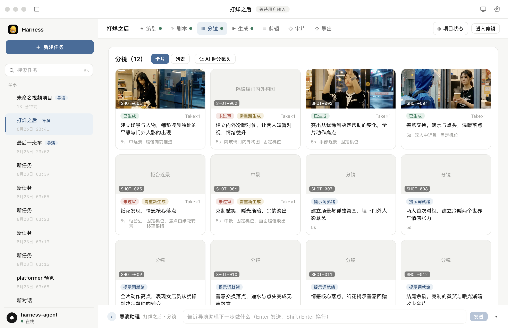
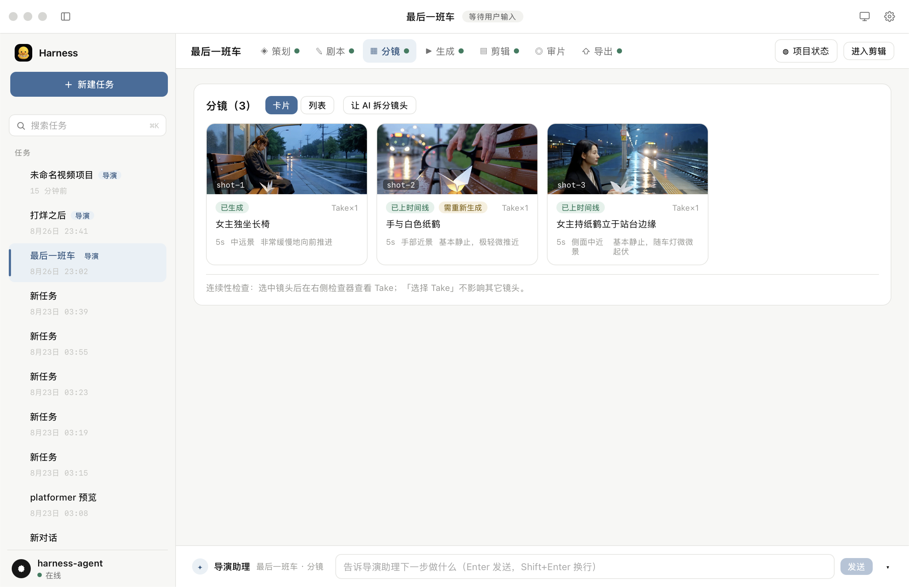
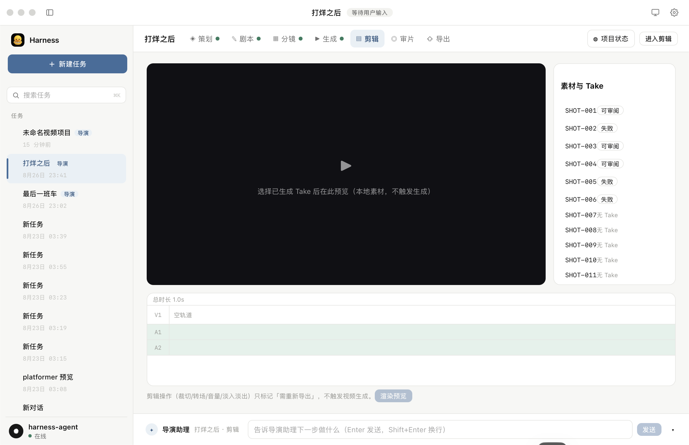
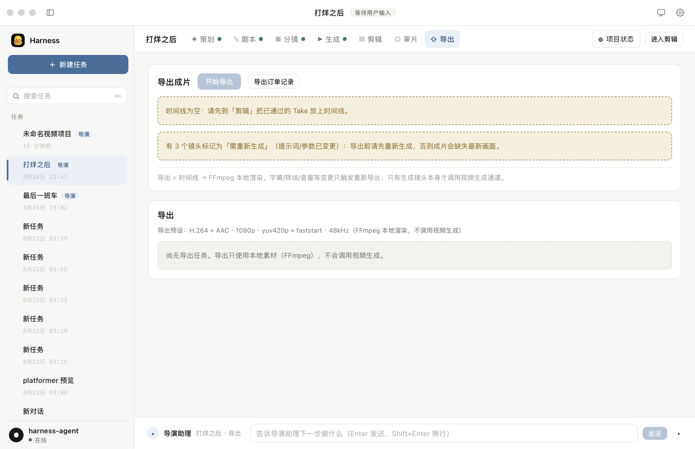
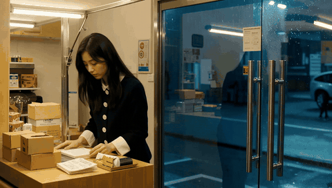
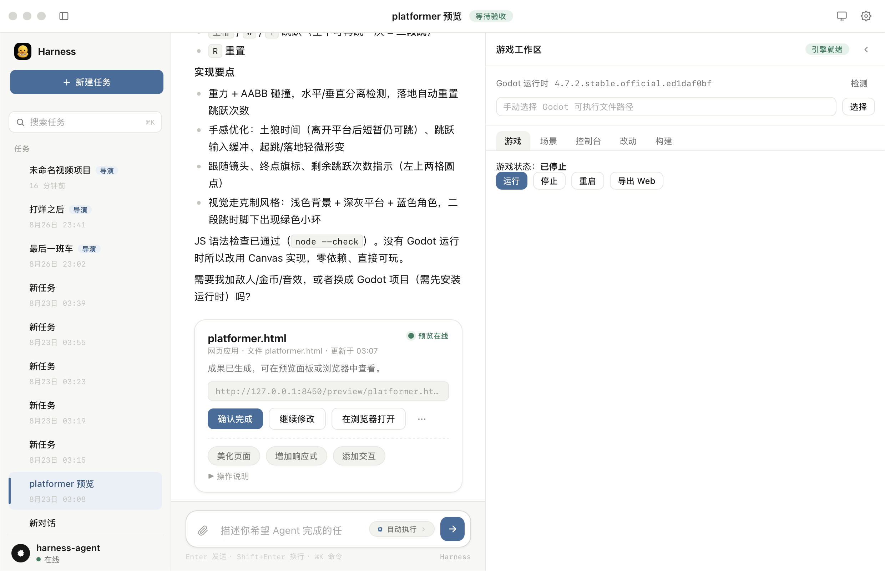

# Greenlight · AI 导演工作台

> 把 AI 视频从「抽一次卡」变成一条**可管理的拍摄流水线**——项目、场景、镜头、Take、时间线、成片，全在一个 macOS 桌面应用里闭环。

[](https://tauri.app)
[](https://react.dev)
[](https://www.typescriptlang.org)
[](#)
[](#)



---

## 这是什么

**Greenlight 的重心是一个 AI 导演工作台（Greenlight Director）**。

它不是「输入一句话，等一条视频」的生成器，而是一套按真实剧组结构组织的生产系统：**项目 → 场景 → 镜头 → Take → 素材 → 时间线 → 成片**。镜头交给火山方舟 Seedance 生成，剪辑、字幕、转场、配乐、合片全部走本地 FFmpeg。

外壳是一个 Tauri 桌面应用（React + TypeScript），本地跑 Node 侧车服务，没有云端账号、没有服务器依赖——项目数据就在你自己机器的目录里。

> 除导演工作台外，应用还内置了一个通用 Agent 对话（真实工具流 + 分层记忆）和 Godot 运行时作为底座。本文主要讲导演工作台，这两块在 [其他能力](#其他能力) 里一句话带过。

---

## 核心命题：AI 视频的瓶颈不是生成，是修改

现有 AI 视频工具几乎都是黑盒：一句话进，一条片子出。可一旦你真的在做一个片子就会发现，**真正的成本发生在修改上**——改一句台词、换一个转场、调一次节奏，很多工具的做法是「重新生成一遍」。钱和时间就这样被反复烧掉。

Director 的每一处设计都在回答同一个问题：**哪些操作必须花钱，哪些操作一分钱都不该花？**

| 纪律 | 做法 | 效果 |
|---|---|---|
| **生成 / 渲染分离** | 改 Prompt、参考图 → 只标镜头 dirty；改时间线、字幕、转场、配乐 → 只标渲染 dirty | 调字幕、换音乐**技术上不可能**触发付费生成 |
| **生成指纹 + 缓存** | 每次生成请求算一个 SHA-256 `generation_key`，命中缓存直接复用 | 同样的镜头不会付两次钱；网络重试也不会重复下单 |
| **Take 永不覆盖** | 重新生成永远新建一个 Take，旧结果保留 | 「一条镜头拍多条，导演挑一条」——选错随时换回来 |
| **付费保护** | 只有显式点「生成镜头 / 重新生成 / 批量生成」并经确认面板确认，才会调用 Seedance | 改项目名、拖动排序、切预览比例**都不可能**误触下单 |

这套纪律的落点是产品里一句写在导出页上的话：**「导出 = 时间线 → FFmpeg 本地渲染，只有生成镜头本身才调用视频生成通道。」**

---

## 界面

### 分镜台 · 一个项目一张镜头表

镜头以卡片铺开，每张卡就是一次拍摄的完整约定：**运镜、时长、景别、固定机位要求、提示词描述**，以及这条镜头当前的状态（已生成 / 待重新生成 / 未过审 / 已上时间线）。改提示词只影响这一条，不动别的。



### 剪辑与时间线 · 只在本地动刀

左侧预览播放器只播**已生成的本地素材**（预览不触发任何生成），下方是 V1 / A1 / A2 轨道，右侧列出每个镜头的 Take 供选择审阅。剪切、转场、音量、淡入淡出一律标记为「需重新导出」，等合片时由 FFmpeg 统一处理。



### 导出 · 花钱与不花钱的分界

导出页把两件事说清楚：成片导出走 FFmpeg（H.264 · AAC · 1080p），以及**哪几条镜头还有变动、必须先重新生成**。导出订单单独记账，可以回溯每一次渲染。



---

## 创作流水线

顶部七个阶段贯穿一个项目，每个阶段的状态都来自真实数据，不是占位符：

```
策划  →  剧本  →  分镜  →  生成  →  剪辑  →  审片  →  导出
brief    script   shot     seedance  timeline  review    ffmpeg
```

- **策划 / 剧本**：先定调性与叙事，产出可编辑的剧本
- **分镜**：把剧本拆成镜头，可以「让 AI 拆分镜头」，也可以手写
- **生成**：按镜头逐个生成 Take，付费操作全部集中在这一步
- **剪辑 / 审片**：时间线组装、逐条审阅、选定 Take
- **导出**：本地渲染出片

任务状态机全程持久化在 SQLite 里，**重启应用能接着干**：

```
draft → awaiting_approval → queued → generating → succeeded / failed / cancelled
      → downloading → ready_for_review → selected → locked
```

---

## 实际产出

仓库里放了两条真实跑出来的片子（都在 `assets/videos/`）：

**《最后一班车》** —— 完整走完「分镜 → 生成 → 剪辑 → 导出」的成片（15s · 1080p）：


[下载完整视频 · 1080p mp4](assets/videos/last-bus.mp4)

**《打烊之后》** —— 单个镜头的生成结果（Take 01，12 条分镜之一，5s · 1080p）：



[下载完整视频 · 1080p mp4](assets/videos/closing-time-take-01.mp4)

---

## 快速开始

### 方式一：直接下载（macOS）

从 [Releases](https://github.com/zfreeya/greenlight/releases) 下载 `Greenlight-macOS-*.zip`（约 350MB，内嵌 Node 运行时与全部本地服务，无需另装依赖）：

```bash
unzip Greenlight-macOS-v0.1.0.zip -d /Applications   # 或解压后拖进「应用程序」
xattr -cr /Applications/Greenlight.app                # 未签名应用，首次启动前执行一次
open /Applications/Greenlight.app
```

应用自带记忆与工具服务（首启自动注册为 launchd 常驻，秒开不打断）；项目数据落在 `~/Harness/`。对话用的 DeepSeek Key 在首次启动时引导配置，视频生成需要另配火山方舟 `ARK_API_KEY`（见下）。

### 方式二：从源码构建

**环境**：macOS · Node 20+ · Rust（Tauri）· Python 3.10+ · FFmpeg · Godot（可选，游戏能力用）

```bash
git clone git@github.com:zfreeya/greenlight.git
cd greenlight
npm install
```

**配置 Seedance（火山方舟）**：

```bash
python3 -m venv .venv && source .venv/bin/activate
python -m pip install --upgrade pip
python -m pip install --upgrade "volcengine-python-sdk[ark]"

export ARK_API_KEY="你的 Key"          # 正式桌面端写入 macOS Keychain，不落仓库
export SEEDANCE_BILLING_MODE="agent_plan"   # 或 platform
export SEEDANCE_MODEL="你的模型 ID"
```

**安装 FFmpeg**（未安装时应用只返回安装计划，不改你的 shell 配置）：

```bash
HOMEBREW_API_DOMAIN="https://mirrors.tuna.tsinghua.edu.cn/homebrew-bottles/api" \
HOMEBREW_BOTTLE_DOMAIN="https://mirrors.tuna.tsinghua.edu.cn/homebrew-bottles" \
brew install ffmpeg
```

**开发 / 打包**：

```bash
npm run tauri dev      # 开发模式（devUrl http://localhost:1420）
npm run build          # 前端 tsc + vite build
npm run tauri build    # → src-tauri/target/release/bundle/macos/Harness.app
```

**单独跑 Director 服务与测试**：

```bash
node tools-server/director-server.mjs --workspace ./workspace   # 127.0.0.1:8456
node --test tools-server/director/*.test.mjs                    # 单元 + 集成（离线，不调用付费 API）

# 真实付费冒烟（双门禁，显式确认后才跑）
RUN_PAID_E2E=1 PAID_E2E_CONFIRM=yes ARK_API_KEY=... \
  node --test tools-server/director/paid-e2e.test.mjs
```

---

## 架构速览

**一条 .app 自包含**：应用包内含 Node 运行时与全部侧车服务，启动时把服务注册为 launchd 常驻服务（已健康则不动，秒开不打断）。

| 服务 | 端口 | 职责 |
|---|---|---|
| MemoryCore | 8420 | 分层记忆（L0 对话 → L1 事实 → L2 场景 → L3 画像） |
| MemoryProxy | 8096 | 模型转发（含工具透传） |
| tools-server | 8450 | 真实工具执行（bash / read / write / edit / glob / grep / fetch） |
| Godot server | 8455 | 引擎检测与游戏运行 |
| **director-server** | **8456** | **导演生产系统：项目 / 镜头 / Take / 生成 / 渲染** |

Agent 的工作目录固定为 `~/Harness`，项目数据（`~/Harness/director/`）与生成素材都在本地，随时可以备份、迁移、直接看文件。

**Seedance 调用**走 Python sidecar（`tools-server/director/seedance/worker.py`），JSON-RPC over stdin/stdout，Agent Plan / Platform 两条通道严格隔离——**失败不静默换通道**，避免账单口径混乱。

---

## 其他能力

这两块是底座，不是主角，简单带过：

- **通用 Agent 对话**：模型自主调用 bash / read / write / edit / glob / grep / fetch 等真实工具，能读代码仓库、跑命令、读写文件拿真实结果再回答；对话与任务持久化，重启不丢；回答支持 Markdown / GFM 渲染；内置浏览器预览面板，agent 写出的网页可直接在侧栏实时渲染。
- **Godot 内嵌运行时**：Godot 只作为 Harness 内部的运行 / 渲染 / 校验 / 导出引擎（不是外挂插件，用户不离开 Harness）。检测、项目创建、场景解析、受控运行、日志与退出码分类都是真实链路。



---

## 目录结构

```
src/
  App.tsx             全部 UI 骨架与三栏布局
  DirectorWorkspace.tsx   导演工作台：分镜台 / 生成 / 剪辑 / 审片 / 导出
  director/phases.tsx     七个创作阶段的视图
  harness.tsx         Agent 引擎：LLM 工具循环 + 会话持久化 + 记忆召回
  memory.ts           MemoryCore 直连 + MemoryProxy 转发
  state.ts            类型与状态模型（无 mock 数据）
tools-server/
  index.mjs           零依赖工具执行服务（工作目录沙箱）
  director-server.mjs 导演服务入口
  director/
    generation.mjs    generation_key 计算、缓存命中、幂等下单
    ffmpeg.mjs        本地渲染管线
    prompt-compiler.mjs  分镜 → 生成请求编译
    seedance/worker.py   官方 SDK sidecar（JSON-RPC）
src-tauri/
  src/lib.rs          setup 钩子：生成配置 + 拉起常驻服务
  resources/          打包资源（node / memory-core / memory-proxy / tools-server）
assets/               README 截图与演示视频
docs/                 架构、状态机、安全、评审记录
```

## 文档

| 文档 | 内容 |
|---|---|
| [`docs/seedance-director-architecture.md`](docs/seedance-director-architecture.md) | 导演系统整体架构 |
| [`docs/generation-state-machine.md`](docs/generation-state-machine.md) | 任务状态机与生命周期 |
| [`docs/designs/batch-generation-confirm.md`](docs/designs/batch-generation-confirm.md) | 批量生成的付费确认设计 |
| [`docs/designs/reverse-workflow.md`](docs/designs/reverse-workflow.md) | 逆向工作流（从已有素材反推镜头） |
| [`docs/MEMORY.md`](docs/MEMORY.md) · [`docs/TOOLS.md`](docs/TOOLS.md) | 记忆系统 / 工具服务设计 |
| [`docs/GAME-AGENT-DESIGN.md`](docs/GAME-AGENT-DESIGN.md) | 游戏 Agent 设计 |
| [`docs/security.md`](docs/security.md) | 密钥与本地安全约定 |
| [`docs/reviews/`](docs/reviews/) | 设计评审与战略复盘记录 |

## 快捷键

`Enter` 发送 · `Shift+Enter` 换行 · `⌘K` 命令面板 · `⌘N` 新对话 · `Esc` 关闭浮层 · `⌘W` 关窗

---

## 说明

个人项目，未附开源许可，代码与设计仅供交流参考。**仓库内不含任何 API Key 或凭证**——密钥通过 macOS Keychain / 本地环境注入，请勿提交 `.env`、`.key`、`credentials*.json`（已在 `.gitignore` 中拦截）。
